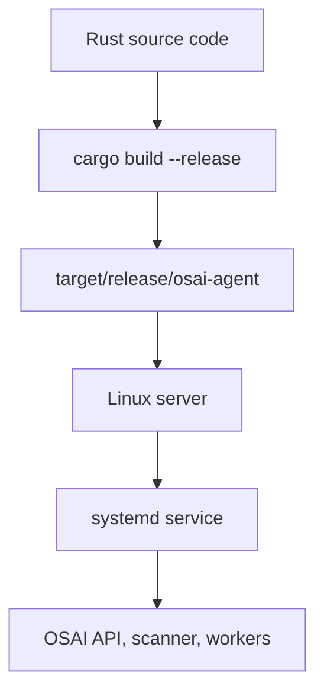
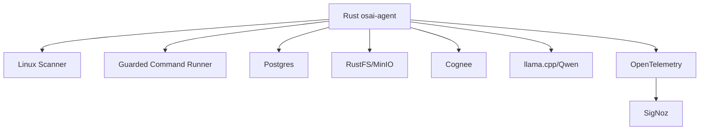

# Rust, Binary Builds, and Real OSAI Use Cases

This guide explains why Rust is a strong foundation for OSAI, what a Rust binary is, how it is built, and how Rust is used in real DevOps + AI agent workflows.

OSAI depends heavily on Rust because the agent needs to:

- scan Linux systems safely
- read processes, ports, disks, memory, services, and containers
- expose a fast API/dashboard
- store exact facts in PostgreSQL
- store raw evidence in object storage such as RustFS or MinIO
- call Cognee for memory retrieval
- call llama.cpp/Qwen for local reasoning
- emit logs, metrics, and traces through OpenTelemetry
- run as one reliable Linux binary under `systemd`

Rust is useful here because it gives performance close to C/C++, but with much stronger memory safety.

## 1. Short Definition Of Rust

Rust is a compiled systems programming language designed for:

- memory safety
- high performance
- concurrency
- reliability
- low-level control without a garbage collector
- building small and fast command-line tools, servers, agents, daemons, and infrastructure software

Rust is used where programs must be fast, predictable, and safe:

- Linux agents
- CLI tools
- API servers
- proxies
- databases
- container tools
- embedded systems
- blockchain infrastructure
- AI/ML infrastructure
- observability collectors
- security scanners

For OSAI, Rust is not the AI model itself. Rust is the control plane around the AI.

```text
Rust does the exact work.
Qwen does the reasoning.
Cognee recalls memory.
Postgres stores facts.
RustFS stores raw evidence.
SigNoz observes the full workflow.
```

## 2. Why Rust Matters In OSAI

An AI DevOps agent is dangerous if it is only text generation. It needs a strong runtime layer that can collect evidence before reasoning.

Rust is good for that runtime layer because it can:

- inspect the OS
- run controlled commands
- parse structured output
- enforce guardrails
- keep typed records
- expose API endpoints
- run background workers
- write to databases
- call other services over HTTP
- produce telemetry

In simple words:

> Rust is the body and nervous system of OSAI. Qwen is the reasoning brain. Cognee is memory.

## 3. What Is A Rust Binary?

A Rust binary is the final executable file produced after compiling Rust source code.

Example project:

```text
osai-agent/
  Cargo.toml
  src/
    main.rs
```

Build command:

```bash
cargo build --release
```

Output:

```text
target/release/osai-agent
```

That file is the binary.

You can run it directly:

```bash
./target/release/osai-agent
```

Or install it:

```bash
sudo install -m 0755 target/release/osai-agent /usr/local/bin/osai-agent
osai-agent
```

## 4. Why Binary Feature Is Powerful

Rust binaries are powerful because they let you ship one executable to a server.

Instead of asking the server to understand your full source project, you can provide:

```text
/usr/local/bin/osai-agent
```

Then run it using:

```bash
osai-agent
```

This is valuable for DevOps because:

- no source code is needed on production
- startup is fast
- deployment is simple
- systemd can manage it
- Docker images can be smaller
- rollback is easy
- the binary can run on Ubuntu, Red Hat, or AlmaLinux if built for the correct target

## 5. Source Code To Binary Flow



## 6. Debug Build vs Release Build

Rust has two common build modes.

| Build Type | Command | Output Path | Use Case |
|---|---|---|---|
| Debug | `cargo build` | `target/debug/app-name` | development, fast compile, slower runtime |
| Release | `cargo build --release` | `target/release/app-name` | production, optimized, faster runtime |

For production OSAI:

```bash
cargo build --release
```

For learning:

```bash
cargo run
```

## 7. Cargo.toml: Rust Project Control File

`Cargo.toml` tells Rust:

- project name
- version
- Rust edition
- dependencies
- binary targets

Example:

```toml
[package]
name = "osai-agent"
version = "0.1.0"
edition = "2021"

[dependencies]
tokio = { version = "1", features = ["full"] }
axum = "0.7"
serde = { version = "1", features = ["derive"] }
serde_json = "1"
reqwest = { version = "0.12", features = ["json"] }
tracing = "0.1"
tracing-subscriber = "0.3"
```

Topics to know:

- Cargo
- crates
- semantic versioning
- features
- release builds
- dependency locking with `Cargo.lock`

## 8. OSAI Binary Layout

OSAI can have multiple Rust binaries in one project:

```text
src/main.rs                         -> osai-agent
src/bin/osai-storage-worker.rs      -> osai-storage-worker
src/bin/osai-cognee-ingest.rs       -> osai-cognee-ingest
src/bin/osai-ask.rs                 -> osai-ask
```

Build all:

```bash
cargo build --release
```

Output:

```text
target/release/osai-agent
target/release/osai-storage-worker
target/release/osai-cognee-ingest
target/release/osai-ask
```

This is a strong production pattern because each binary has one clear job.

## 9. How Rust Is Used In OSAI

| Rust Binary | Main Job | Why Rust Fits |
|---|---|---|
| `osai-agent` | scanner, API, dashboard, guardrails | fast, safe, always running |
| `osai-storage-worker` | save scans to Postgres and RustFS | reliable background worker |
| `osai-cognee-ingest` | push Markdown memories into Cognee | controlled integration |
| `osai-ask` | recall memory and call Qwen | CLI-friendly reasoning path |
| future `osai-repair` | propose/approve repair commands | safety and audit control |

## 10. Rust As A Linux Scanner

Rust can read Linux system files such as:

- `/etc/os-release`
- `/proc/meminfo`
- `/proc/cpuinfo`
- `/proc/net/tcp`
- `/proc/[pid]/status`

Example: read OS information.

```rust
use std::fs;

fn main() -> std::io::Result<()> {
    // Topic to know: Result<T, E>
    // Rust does not use exceptions like Python. Errors are returned as Result.

    let os_release = fs::read_to_string("/etc/os-release")?;

    // Topic to know: String and borrowing
    // read_to_string returns an owned String. We can safely print it.

    println!("{os_release}");

    Ok(())
}
```

Why this matters:

- OSAI can detect Ubuntu, Red Hat, AlmaLinux, kernel version, and OS family.
- The agent does not need to guess the server environment.

## 11. Rust As A Memory Scanner

Example: parse `/proc/meminfo`.

```rust
use std::collections::HashMap;
use std::fs;

fn main() -> std::io::Result<()> {
    // Topic to know: HashMap
    // A HashMap stores key-value data, useful for system facts.

    let text = fs::read_to_string("/proc/meminfo")?;
    let mut values = HashMap::new();

    for line in text.lines() {
        // Topic to know: iterators
        // lines() returns an iterator. Rust can process data without copying everything.

        if let Some((key, value)) = line.split_once(':') {
            let number_kb = value
                .split_whitespace()
                .next()
                .unwrap_or("0")
                .parse::<u64>()
                .unwrap_or(0);

            values.insert(key.to_string(), number_kb);
        }
    }

    let total = values.get("MemTotal").copied().unwrap_or(0);
    let available = values.get("MemAvailable").copied().unwrap_or(0);

    println!("memory_total_mb={}", total / 1024);
    println!("memory_available_mb={}", available / 1024);

    Ok(())
}
```

Topics to know:

- `HashMap`
- `Option`
- `Result`
- iterators
- parsing strings
- ownership and borrowing

OSAI use case:

- detect high memory usage
- warn when llama.cpp/Qwen is slow because RAM is low
- store memory facts in Postgres
- include memory evidence in a diagnostic prompt

## 12. Rust As A Safe Command Runner

OSAI sometimes needs command output, such as:

```bash
docker ps
systemctl status docker
ss -lntp
```

Rust can run commands, capture output, and apply guardrails.

```rust
use std::process::Command;

fn main() -> std::io::Result<()> {
    // Topic to know: command execution
    // std::process::Command runs OS commands safely when arguments are separated.

    let output = Command::new("docker")
        .arg("ps")
        .arg("--format")
        .arg("{{.Names}} {{.Status}}")
        .output()?;

    // Topic to know: exit status
    // A command can run but still fail. Always check status.

    if !output.status.success() {
        eprintln!("docker ps failed");
        return Ok(());
    }

    // Topic to know: UTF-8 conversion
    // Command output is bytes. Convert carefully before using as text.

    let stdout = String::from_utf8_lossy(&output.stdout);
    println!("{stdout}");

    Ok(())
}
```

Important security rule:

> Do not pass user text directly into shell commands.

Prefer:

```rust
Command::new("docker").arg("ps").output()
```

Avoid:

```rust
Command::new("sh").arg("-c").arg(user_input).output()
```

Topics to know:

- `std::process::Command`
- command arguments
- shell injection
- exit codes
- stdout/stderr
- guardrails

OSAI use case:

- only allow approved diagnostic commands
- block destructive commands unless approved
- store command output as evidence
- send summarized facts to Qwen

## 13. Rust As A JSON Producer

OSAI should store machine facts as JSON.

Example:

```rust
use serde::Serialize;

#[derive(Serialize)]
struct MemorySnapshot {
    // Topic to know: structs
    // Structs define exact data shape.

    total_mb: u64,
    available_mb: u64,
    used_percent: f64,
}

fn main() -> Result<(), Box<dyn std::error::Error>> {
    // Topic to know: serde
    // serde converts Rust structs into JSON and back.

    let snapshot = MemorySnapshot {
        total_mb: 8192,
        available_mb: 2048,
        used_percent: 75.0,
    };

    let json = serde_json::to_string_pretty(&snapshot)?;
    println!("{json}");

    Ok(())
}
```

Output:

```json
{
  "total_mb": 8192,
  "available_mb": 2048,
  "used_percent": 75.0
}
```

Topics to know:

- structs
- derive macros
- `serde`
- JSON serialization
- error handling

OSAI use case:

- save scan snapshots
- create incident records
- send API responses
- build prompt packages for Qwen

## 14. Rust As An API Server

Rust can expose an API for dashboard and automation.

Example with Axum:

```rust
use axum::{routing::get, Json, Router};
use serde::Serialize;
use std::net::SocketAddr;

#[derive(Serialize)]
struct HealthResponse {
    status: &'static str,
    service: &'static str,
}

async fn health() -> Json<HealthResponse> {
    // Topic to know: async functions
    // async lets Rust handle many requests without one OS thread per request.

    Json(HealthResponse {
        status: "ok",
        service: "osai-agent",
    })
}

#[tokio::main]
async fn main() {
    // Topic to know: Tokio runtime
    // Tokio is the async runtime commonly used for Rust network servers.

    let app = Router::new().route("/api/health", get(health));
    let addr = SocketAddr::from(([127, 0, 0, 1], 8000));

    let listener = tokio::net::TcpListener::bind(addr).await.unwrap();
    axum::serve(listener, app).await.unwrap();
}
```

Topics to know:

- HTTP
- Axum
- Tokio
- async/await
- JSON APIs
- routing
- socket binding

OSAI use case:

- `/api/health`
- `/api/snapshot`
- `/api/history`
- `/api/ask`
- `/api/actions/propose`
- `/api/actions/approve`

## 15. Rust As A Background Worker

Not every job should happen inside the API request. Some jobs should run in the background.

Example:

```rust
use std::time::Duration;

#[tokio::main]
async fn main() {
    loop {
        // Topic to know: loops and async sleep
        // Background workers often run forever and sleep between cycles.

        println!("scan server, store facts, push memory");

        tokio::time::sleep(Duration::from_secs(30)).await;
    }
}
```

Topics to know:

- loops
- async sleep
- worker design
- graceful shutdown
- retry logic
- idempotency

OSAI use case:

- scan server every 30 seconds
- store scan in Postgres
- upload raw JSON to RustFS
- convert scan to Markdown memory
- send useful summaries to Cognee

## 16. Rust As A Bridge To llama.cpp/Qwen

llama.cpp exposes an HTTP API. Rust can call that API.

Example request body:

```rust
use serde::{Deserialize, Serialize};

#[derive(Serialize)]
struct ChatRequest {
    model: String,
    messages: Vec<Message>,
    temperature: f32,
}

#[derive(Serialize)]
struct Message {
    role: String,
    content: String,
}

#[derive(Deserialize)]
struct ChatResponse {
    // Topic to know: API response structs
    // You model only the fields you need.

    choices: Vec<Choice>,
}

#[derive(Deserialize)]
struct Choice {
    message: MessageResponse,
}

#[derive(Deserialize)]
struct MessageResponse {
    content: String,
}
```

Example call:

```rust
async fn ask_llama(endpoint: &str, prompt: &str) -> Result<String, reqwest::Error> {
    // Topic to know: HTTP clients
    // reqwest is commonly used to call REST/JSON APIs from Rust.

    let body = ChatRequest {
        model: "osai-llm".to_string(),
        temperature: 0.2,
        messages: vec![
            Message {
                role: "system".to_string(),
                content: "You are OSAI, a cautious DevOps diagnostic agent.".to_string(),
            },
            Message {
                role: "user".to_string(),
                content: prompt.to_string(),
            },
        ],
    };

    let response: ChatResponse = reqwest::Client::new()
        .post(format!("{endpoint}/chat/completions"))
        .json(&body)
        .send()
        .await?
        .json()
        .await?;

    Ok(response
        .choices
        .first()
        .map(|choice| choice.message.content.clone())
        .unwrap_or_default())
}
```

Topics to know:

- HTTP POST
- JSON request/response
- async Rust
- `reqwest`
- structs
- vectors
- `Option`
- error handling

OSAI use case:

- Rust gathers evidence first
- Rust builds a safe prompt
- Rust sends only useful context to Qwen
- Rust stores the final answer with source facts

## 17. Rust As A Bridge To Cognee

Cognee is memory and retrieval. Rust can send Markdown memory files or text summaries to Cognee over HTTP.

Example memory text:

```md
# Incident: llama.cpp slow due to memory pressure

## Evidence

- Host memory usage: 92%
- llama.cpp container running
- No Docker restart observed

## Suggested Fix

- reduce context size
- stop unused containers
- retry inference
```

Rust can send this as an HTTP upload or JSON payload depending on Cognee API design.

Topics to know:

- REST APIs
- file upload
- JSON body
- Markdown as AI-readable context
- retries
- API authentication

OSAI use case:

- preserve incident knowledge
- recall previous fixes
- build better future answers

## 18. Rust And PostgreSQL

Postgres stores exact facts.

Example table:

```sql
CREATE TABLE osai_scan (
    id BIGSERIAL PRIMARY KEY,
    created_at TIMESTAMPTZ DEFAULT now(),
    host_name TEXT NOT NULL,
    scan_json JSONB NOT NULL,
    memory_markdown TEXT NOT NULL
);
```

Rust writes:

- exact JSON snapshot
- Markdown summary
- severity
- tags
- object storage path
- ingestion state for Cognee

Topics to know:

- SQL
- Postgres
- JSONB
- database migrations
- connection pools
- transactions
- idempotent writes

Common Rust crates:

- `sqlx`
- `tokio-postgres`
- `deadpool-postgres`

## 19. Rust And RustFS/MinIO

Object storage keeps larger raw evidence:

- full scan JSON
- command logs
- Markdown memory files
- report files
- model metadata

Rust can upload objects using S3-compatible APIs.

Object paths can look like:

```text
scans/2026/07/07/host-a-scan.json
memory/scans/2026/07/07/host-a-summary.md
incidents/inc-2026-07-07-001.md
```

Topics to know:

- S3 object storage
- buckets
- keys
- access key/secret key
- multipart upload
- content type
- retention

OSAI use case:

- Postgres stores searchable metadata
- RustFS stores full raw evidence
- Cognee stores recall-friendly memory

## 20. Rust And OpenTelemetry

Rust can emit:

- logs
- metrics
- traces

Example trace idea:

```text
trace: ask_osai
  span: receive_question
  span: scan_host
  span: query_postgres
  span: recall_cognee
  span: build_prompt
  span: call_llama_cpp
  span: return_answer
```

Topics to know:

- observability
- OpenTelemetry
- traces
- spans
- attributes
- metrics
- structured logs

OSAI use case:

- see which part is slow
- debug Qwen latency
- debug Cognee recall time
- prove what evidence was used
- show request lifecycle in SigNoz

## 21. Rust Ownership: The Most Important Concept

Ownership is Rust's main safety system.

Simple meaning:

> Every value has one owner. When the owner goes out of scope, Rust frees the value.

Example:

```rust
fn main() {
    // Topic to know: ownership
    // message owns the String.

    let message = String::from("hello osai");

    // Topic to know: borrowing
    // print_message borrows message using &String, so ownership stays here.

    print_message(&message);

    println!("still usable: {message}");
}

fn print_message(input: &String) {
    println!("{input}");
}
```

Why this matters:

- prevents use-after-free bugs
- avoids many memory leaks
- avoids data races
- makes long-running agents safer

## 22. Rust Result And Option

Rust forces you to handle failure.

`Option<T>` means:

```text
Some(value)
None
```

`Result<T, E>` means:

```text
Ok(value)
Err(error)
```

Example:

```rust
fn parse_cpu_percent(input: &str) -> Result<f64, std::num::ParseFloatError> {
    // Topic to know: Result
    // Parsing can fail, so the function returns Result.

    input.parse::<f64>()
}

fn main() {
    match parse_cpu_percent("87.5") {
        Ok(value) => println!("cpu={value}%"),
        Err(err) => eprintln!("failed to parse CPU: {err}"),
    }
}
```

Why this matters for OSAI:

- commands fail
- files may not exist
- Docker may not be running
- Cognee may be unreachable
- llama.cpp may timeout
- Postgres may reject a query

Rust makes these failure paths visible.

## 23. Rust Concurrency

OSAI may need to do multiple things:

- scan host
- scan Docker
- read ports
- call Cognee
- call llama.cpp
- write to Postgres
- emit telemetry

Rust handles this with async tasks or threads.

Example:

```rust
#[tokio::main]
async fn main() {
    // Topic to know: tokio::join!
    // Run async tasks concurrently and wait for all of them.

    let host_scan = scan_host();
    let docker_scan = scan_docker();

    let (host_result, docker_result) = tokio::join!(host_scan, docker_scan);

    println!("host={host_result:?}");
    println!("docker={docker_result:?}");
}

async fn scan_host() -> String {
    "host ok".to_string()
}

async fn scan_docker() -> String {
    "docker ok".to_string()
}
```

Topics to know:

- async/await
- Tokio
- tasks
- threads
- channels
- shared state
- `Arc`
- `Mutex`

## 24. Rust Guardrails For Repair Actions

An AI agent must not directly run dangerous repair commands.

Good OSAI pattern:

```text
Qwen suggests repair
Rust checks command policy
Rust creates approval request
Human approves
Rust runs command
Rust stores audit record
```

Example guardrail:

```rust
fn is_allowed_command(program: &str, args: &[String]) -> bool {
    // Topic to know: slices
    // &[String] lets the function read a list without owning it.

    match program {
        "docker" => {
            // Allow inspection first.
            args.first().map(|s| s.as_str()) == Some("ps")
                || args.first().map(|s| s.as_str()) == Some("logs")
        }
        "systemctl" => {
            // Allow status, block restart/stop by default.
            args.first().map(|s| s.as_str()) == Some("status")
        }
        "ss" => true,
        "df" => true,
        "free" => true,
        _ => false,
    }
}
```

Topics to know:

- pattern matching
- slices
- vectors
- command safety
- policy design
- audit logs

## 25. How To Run Rust Binary With systemd

Example service:

```ini
[Unit]
Description=OSAI Agent
After=network-online.target
Wants=network-online.target

[Service]
Type=simple
EnvironmentFile=/opt/osai/config/osai.env
ExecStart=/usr/local/bin/osai-agent
Restart=always
RestartSec=5
User=osai
Group=osai
WorkingDirectory=/opt/osai/app

[Install]
WantedBy=multi-user.target
```

Install:

```bash
sudo cp target/release/osai-agent /usr/local/bin/osai-agent
sudo systemctl daemon-reload
sudo systemctl enable --now osai-agent
```

Check:

```bash
systemctl status osai-agent
journalctl -u osai-agent -f
```

Topics to know:

- systemd
- environment files
- Linux users/groups
- service restart policy
- logs with journalctl

## 26. Rust Binary In Docker

Rust can be built in one image and copied into a small runtime image.

Example:

```dockerfile
FROM rust:1-bookworm AS builder
WORKDIR /app
COPY . .
RUN cargo build --release

FROM debian:bookworm-slim
COPY --from=builder /app/target/release/osai-agent /usr/local/bin/osai-agent
EXPOSE 8000
CMD ["osai-agent"]
```

Topics to know:

- Docker
- multi-stage builds
- image size
- runtime dependencies
- ports
- container logs

Why this is useful:

- production image does not need Rust compiler
- smaller image
- less attack surface
- faster startup

## 27. Rust Binary On Bare Metal vs Container

| Runtime | Best For | Notes |
|---|---|---|
| Bare metal binary | host scanner, system agent, service inspection | better access to `/proc`, systemd, ports, logs |
| Docker container | API, workers, isolated services | easier packaging, but host access needs mounts/permissions |
| Kubernetes pod | scalable services | good later, but host-level scanning is more complex |

For OSAI:

- host scanner is often best as a systemd binary
- Postgres/RustFS/Cognee/llama.cpp are good in Docker Compose
- UI/API can run as binary or container depending on target

## 28. Rust Cross-Compilation

A binary must match the target OS and CPU architecture.

Common target:

```text
x86_64-unknown-linux-gnu
```

Check server architecture:

```bash
uname -m
```

Build on same architecture:

```bash
cargo build --release
```

For fully static Linux binaries, many teams use musl:

```bash
rustup target add x86_64-unknown-linux-musl
cargo build --release --target x86_64-unknown-linux-musl
```

Topics to know:

- CPU architecture
- glibc vs musl
- dynamic linking
- static linking
- cross-compilation
- Linux distribution compatibility

## 29. Practical OSAI Architecture With Rust



Rust's responsibility:

- collect exact facts
- enforce safety
- call services
- record audit trail
- expose API
- emit telemetry

Qwen's responsibility:

- reason over prepared context
- explain possible causes
- suggest next steps

Cognee's responsibility:

- remember previous incidents
- recall similar fixes
- provide long-term context

## 30. Learning Roadmap For Your OSAI Rust Work

Start here:

1. Cargo and project structure
2. variables, functions, structs, enums
3. ownership and borrowing
4. `Result` and `Option`
5. file reading and command execution
6. `serde` and JSON
7. HTTP APIs with Axum
8. async Rust with Tokio
9. database access with SQLx or tokio-postgres
10. Docker and systemd deployment
11. tracing and OpenTelemetry
12. safe command execution and approval workflows

Then go deeper:

- Linux `/proc` and `/sys`
- systemd D-Bus or command integration
- Docker Engine API
- Kubernetes API
- S3-compatible object storage
- prompt packaging
- observability spans
- security hardening
- static binaries and packaging

## 31. Simple Mental Model

Use this mental model:

```text
Rust source code -> cargo build --release -> Linux binary

Rust binary -> runs on server -> scans system -> stores facts -> calls memory -> calls model -> returns answer
```

In OSAI:

```text
Rust = truth collector and control plane
Postgres = exact searchable facts
RustFS/MinIO = raw evidence store
Cognee = memory and retrieval
llama.cpp = local model runtime
Qwen = reasoning model
OpenTelemetry = telemetry format
SigNoz = observability UI
```

## 32. Final Production Statement

OSAI uses Rust because a DevOps AI agent needs more than text generation. It needs a fast and safe system layer that can inspect Linux, Docker, services, ports, memory, storage, and logs; convert that evidence into structured JSON and Markdown memory; store it in Postgres and RustFS; retrieve context through Cognee; ask Qwen through llama.cpp; and expose the full process through APIs and OpenTelemetry.

The Rust binary feature is important because the complete agent can be compiled into a production executable, copied to Ubuntu, Red Hat, or AlmaLinux, managed by systemd, packaged inside Docker, and operated like real infrastructure software.

That is why Rust is the correct foundation for OSAI:

> Rust gives OSAI a reliable body. Cognee gives it memory. Qwen gives it reasoning. SigNoz shows what happened.
